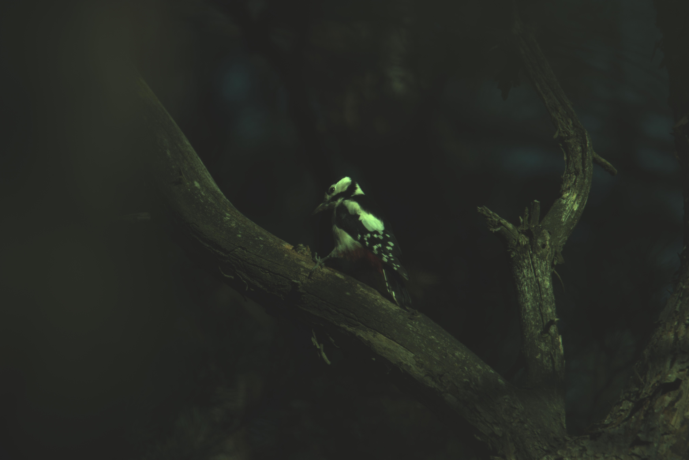

# Exercise 4 - Demosaicing and HDR

This folder contains the solution for **Exercise 4 - Demosaicing and High Dynamic Range** of the Computer Vision Course Project.

The goal of this exercise is to process raw camera sensor data, implement demosaicing, improve image brightness and color, verify sensor linearity, and generate HDR images from multiple exposures.

## Overview

In this exercise, raw image data is processed through a complete image formation pipeline.

The main workflow includes:

- Investigating Bayer patterns
- Implementing a demosaicing algorithm
- Improving luminosity using gamma correction
- Applying white balance using the gray world assumption
- Showing that sensor data is linear
- Creating HDR images from multiple raw exposures
- Applying tone mapping and dynamic range compression
- Implementing a final raw image processing function

## Implementation Details

### 1. Bayer Pattern Investigation

The raw sensor data was analyzed to identify the Bayer filter pattern.  
This step helps determine the correct position of red, green, and blue pixels before reconstructing the full RGB image.

### 2. Demosaicing

A demosaicing algorithm was implemented to reconstruct a full-color RGB image from raw Bayer data.

The demosaicing step estimates missing color values for each pixel and creates a complete RGB image.

### 3. Luminosity Improvement

The demosaiced image can appear dark, so gamma correction was applied to improve brightness.

The implementation uses percentile-based normalization to avoid extreme outliers and improve visual quality.

### 4. White Balance

White balance was applied using the gray world assumption.

This step adjusts the red, green, and blue channels so that the final image has more natural colors.

### 5. Sensor Linearity

The sensor linearity was verified using images captured with different exposure times.

Average red, green, and blue pixel values were plotted against exposure time to confirm the linear relationship between collected light and pixel intensity.

### 6. HDR Image Generation

Multiple raw images with different exposure times were combined to create HDR raw data.

After HDR fusion, the image was processed using:

- Demosaicing
- White balance
- Logarithmic dynamic range compression
- Scaling to the `[0, 255]` range
- Saving as an output image

### 7. iCAM06 HDR Method

The iCAM06 HDR method was implemented and tested with different settings to improve the appearance of HDR images.

### 8. Final Raw Processing Function

A final function named `process_raw` was implemented.

The function takes:

1. Path to a raw `.CR3` file
2. Path where the processed `.jpg` image should be saved

The output image is saved with high JPG quality.

## Results

The following result images were generated during the exercise.

### Task 8 Output

